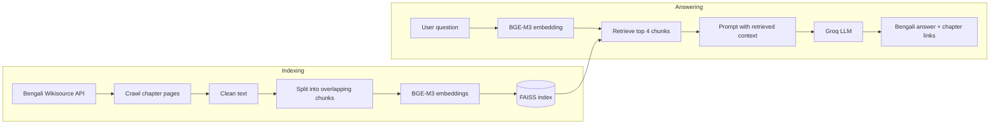

# অব্যক্ত — Bengali RAG Knowledge Base Chatbot


[](LICENSE)

A Bengali question-answering chatbot for **অব্যক্ত** by জগদীশচন্দ্র বসু.

The chatbot uses a Retrieval-Augmented Generation (RAG) pipeline. It retrieves passages from the book, gives those passages to the language model, and answers in Bengali. Each answer includes the relevant chapter link. When the retrieved context does not support an answer, the chatbot returns:

> দুঃখিত, এই প্রশ্নের উত্তর বইটিতে পাওয়া যায়নি।

The project uses only the text of **অব্যক্ত** as its knowledge source.

## Demo

[Watch the demo video](https://drive.google.com/file/d/1YLo0bBXMnBPr1bBhodfietB4jMBjUKIB/view?usp=sharing)

The demo covers the full pipeline, including the Wikisource crawl, index creation, normal book questions with chapter citations, and a question that the book does not answer.

## About the book

|                 |                                                                                                                                    |
| --------------- | ---------------------------------------------------------------------------------------------------------------------------------- |
| **Book**        | অব্যক্ত (_Abyakta_)                                                                                                                |
| **Author**      | জগদীশচন্দ্র বসু (Jagadish Chandra Bose)                                                                                            |
| **Publication** | First published Ashwin 1328 (1921). The Wikisource edition is the third printing (Poush 1364), published by বঙ্গীয় বিজ্ঞান পরিষদ. |
| **Source**      | [Bengali Wikisource](https://bn.wikisource.org/wiki/অব্যক্ত)                                                                       |

The book contains about twenty prose pieces, including essays on plants, sound, light and the "ether", accounts of scientific discovery, and stories such as **পলাতক তুফান**.

The source text uses classical Bengali (সাধু ভাষা), while a user is more likely to ask questions in modern Bengali (চলিত ভাষা). That is one reason semantic retrieval is important here: the wording of a question does not always match the wording in the book.

## How the RAG pipeline works

There is an indexing step and an answering step.



The flow is:

**Wikisource → crawl → clean → chunk → embed → FAISS → retrieve → generate → cite**

### What each part does

| Step                | Implementation                                                                                                                                                                                                                                                              |
| ------------------- | --------------------------------------------------------------------------------------------------------------------------------------------------------------------------------------------------------------------------------------------------------------------------- |
| **Crawling**        | `src/ingest.py` asks the MediaWiki API for pages whose titles start with `অব্যক্ত/`. The chapter list is therefore discovered from Wikisource instead of being hard-coded. Navigation, page numbers and footnote markers are removed, and rate-limit responses are retried. |
| **Cleaning**        | `src/chunking.py` applies Unicode NFC normalization, removes invisible characters, footnote markers and extra whitespace, and keeps zero-width joiners needed by some Bengali characters.                                                                                   |
| **Chunking**        | Chapters are split at paragraph, line and sentence (`।`) boundaries before falling back to spaces. Each chunk keeps its book, chapter, section and source URL.                                                                                                              |
| **Embeddings**      | `src/vector_store.py` uses `BAAI/bge-m3` to turn each chunk into a vector.                                                                                                                                                                                                  |
| **Vector database** | FAISS stores the vectors on disk. A separate index is created for each chunking strategy.                                                                                                                                                                                   |
| **Retrieval**       | `src/rag_chain.py` embeds the question and retrieves the four nearest chunks.                                                                                                                                                                                               |
| **Generation**      | The retrieved chunks and the question are passed to the LLM with instructions to answer only from that context and to respond in Bengali.                                                                                                                                   |
| **Citation**        | Chapter links come from chunk metadata, not from text generated by the LLM.                                                                                                                                                                                                 |

Every setting is kept in [`src/config.py`](src/config.py).

## Embedding model

The project uses `BAAI/bge-m3` for Bengali retrieval.

BGE-M3 is multilingual and can represent Bengali questions and passages in the same vector space. That matters for **অব্যক্ত**, because the book is written in সাধু ভাষা while questions may be written in চলিত ভাষ. In the current evaluation, all 9 answerable questions retrieved a matching chunk within the top 4 results (Hit@4 = 9/9).

The model also supports inputs up to 8192 tokens, which is comfortably above the 500- and 1000-character chunk sizes used here, and it does not require `query:` / `passage:` prefixes.

Two other models considered in the assignment were `multilingual-e5` and `paraphrase-multilingual-MiniLM-L12-v2`. Their documented input requirements and limits were considered, but they were not benchmarked in this project. `multilingual-e5` expects `query:` and `passage:` prefixes, while the MiniLM model truncates inputs at 128 tokens.

## Dataset and crawl

The crawler saved 21 Wikisource pages: the main page plus 20 chapter subpages, with 199,474 characters of raw text before cleaning.

The 20 pieces collected were:

অগ্নি পরীক্ষা, অদৃশ্য আলোক, আকাশ-স্পন্দন ও আকাশ-সম্ভব জগৎ, আহত উদ্ভিদ, উদ্ভিদের জন্ম ও মৃত্যু, গাছের কথা, দীক্ষা, নবীন ও প্রবীণ, নিবেদন, নির্ব্বাক জীবন, পলাতক তুফান, বিজ্ঞানে সাহিত্য, বোধন, ভাগীরথীর উৎস-সন্ধানে, মনন ও করণ, মন্ত্রের সাধন, যুক্তকর, রাণী-সন্দর্শন, স্নায়ুসূত্রে উত্তেজনা-প্রবাহ, and হাজির!.

The smallest chapter is 1,973 characters and the largest is 19,597. A fresh crawl produced the same 21 pages and 199,474 characters. During that run, Wikisource returned two rate-limit responses; the crawler waited 17 seconds and 41 seconds before continuing.

## Configuration

| Setting                   | Value                                    |
| ------------------------- | ---------------------------------------- |
| **Embedding model**       | `BAAI/bge-m3`                            |
| **Default chunk size**    | 500 characters                           |
| **Default overlap**       | 100 characters                           |
| **Comparison chunk size** | 1000 characters                          |
| **Comparison overlap**    | 200 characters                           |
| **Retriever**             | LangChain similarity search, top `k = 4` |
| **Vector DB**             | FAISS (`faiss-cpu`)                      |
| **LLM**                   | Groq `openai/gpt-oss-20b`                |
| **Temperature**           | 0                                        |
| **Interface**             | Streamlit                                |

Chunk metadata contains `book`, `chapter`, `section` and `source_url`. The `section` value is a position such as "part _n_ of _N_" inside a chapter; it is not a heading from the book.

## Evaluation

The evaluation script in [`src/evaluate.py`](src/evaluate.py) runs 10 questions from [`tests/test_questions.json`](tests/test_questions.json). Nine have answers in the book. The tenth deliberately asks for information that is not in the book, so the chatbot is expected to refuse.

The latest run scored **9/10**. The same result was obtained in three evaluation runs. The second and third runs were identical, while the first differed only in the punctuation of question 9's answer.

### Chunking comparison

| Strategy | Chunk size / overlap | Chunks | Hit@1 | Hit@4 |
| -------- | -------------------: | -----: | ----: | ----: |
| `small`  |            500 / 100 |    651 |   7/9 |   9/9 |
| `large`  |           1000 / 200 |    353 |   7/9 |   9/9 |

A retrieval hit means that one of the returned chunks came from the expected chapter and contained the answer keyword.

For the nine answerable questions, the expected chapter appeared within the top four results every time. It appeared as the first result for 7 of the 9 questions. That is the reason the retriever passes four chunks to the LLM instead of relying on only the first result.

The two chunking strategies tied on this test. Since there are only nine answerable questions, one question changes the hit rate by roughly 11 percentage points, so this small set cannot meaningfully separate the two approaches. The 500-character strategy remains the default because four smaller chunks put less text into the prompt.

### Test questions

| #   | Question                                                                                  | Expected answer                                   | Chapter                       | Chatbot answer                                                         | Retrieved | Result   |
| --- | ----------------------------------------------------------------------------------------- | ------------------------------------------------- | ----------------------------- | ---------------------------------------------------------------------- | --------- | -------- |
| 1   | লেখক অজন্তার গুহামন্দিরের বাইরে এসে পর্বতগাত্রে কার মূর্তি খোদিত দেখলেন?                  | প্রশান্ত বুদ্ধমূর্তি                              | যুক্তকর                       | প্রশান্ত বুদ্ধমূর্তি।                                                  | yes       | PASS     |
| 2   | সূর্য পৃথিবী থেকে কত দূরে অবস্থিত বলে লেখক উল্লেখ করেছেন?                                 | নয় কোটি মাইল                                     | আকাশ-স্পন্দন ও আকাশ-সম্ভব জগৎ | নয় কোটি মাইল দূরে অবস্থিত।                                            | yes       | PASS     |
| 3   | লেখকের মতে অতি প্রকাণ্ড বটগাছ কত ছোট বীজ থেকে জন্মায়?                                    | সরিষার চেয়েও ছোট বীজ থেকে                        | গাছের কথা                     | সরিষা অপেক্ষা ছোট বীজ থেকে জন্মায়।                                    | yes       | PASS     |
| 4   | অঙ্কুর বের হওয়ার পর যে অংশ মাটির ভিতরে যায় এবং যে অংশ উপরের দিকে বাড়ে, সেগুলোর নাম কী? | মাটির ভিতরের অংশের নাম মূল, উপরের অংশের নাম কাণ্ড | উদ্ভিদের জন্ম ও মৃত্যু        | মূল এবং কাণ্ড।                                                         | yes       | PASS     |
| 5   | ইতালির অধ্যাপক গ্যালভানিকে লোকেরা কী নামে উপহাস করত?                                      | 'ব্যাঙ-নাচানো' অধ্যাপক                            | মন্ত্রের সাধন                 | লোকেরা তাকে “ব্যাঙ‑নাচান” অধ্যাপক বলে উপহাস করত।                       | yes       | PASS     |
| 6   | সোয়ার্জ কোন ধাতু দিয়ে বেলুন তৈরি করেছিলেন?                                              | আলুমিনিয়াম                                       | মন্ত্রের সাধন                 | অ্যালুমিনিয়াম।                                                        | yes       | PASS     |
| 7   | জাহাজে প্রচণ্ড ঝড়ের সময় লেখক ঢেউ শান্ত করতে সমুদ্রে কী ঢেলে দিয়েছিলেন?                 | 'কুন্তল-কেশরী' নামের কেশতৈল                       | পলাতক তুফান                   | দুঃখিত, এই প্রশ্নের উত্তর বইটিতে পাওয়া যায়নি।                        | yes       | **FAIL** |
| 8   | লঙ্কাদ্বীপ যাওয়ার জন্য লেখক কোন জাহাজে সমুদ্রযাত্রা করেছিলেন?                            | চুসান জাহাজে                                      | পলাতক তুফান                   | চুসান জাহাজে।                                                          | yes       | PASS     |
| 9   | লেখক ছোটবেলায় নদীকে জিজ্ঞাসা করলে নদী কী উত্তর দিত?                                      | নদী উত্তর দিত, "মহাদেবের জটা হইতে"                | ভাগীরথীর উৎস-সন্ধানে          | লেখক ছোটবেলায় নদীকে জিজ্ঞাসা করলে নদী উত্তর দিত: “মহাদেবের জটা হইতে।” | yes       | PASS     |
| 10  | জগদীশচন্দ্র বসু কত সালে নোবেল পুরস্কার পেয়েছিলেন?                                        | বইটিতে এর উল্লেখ নেই।                             | —                             | দুঃখিত, এই প্রশ্নের উত্তর বইটিতে পাওয়া যায়নি।                        | —         | PASS     |

### How the evaluation is scored

For an answerable question, the test passes when the chatbot does not return the refusal sentence and its answer contains one of that question's keywords. Question 10 is the exception: it passes when the chatbot refuses.

This is keyword-based scoring, not semantic grading. A correct answer can fail if it uses different wording, while an incorrect answer can pass if it happens to contain the expected keyword. Question 6 is a simple example: the expected answer uses **আলুমিনিয়াম**, while the chatbot returned **অ্যালুমিনিয়াম**, so both spellings are included in the keyword check.

The evaluation also checks that each expected chapter and keyword exists in the crawled text and warns when something is missing.

### The one failing case

Question 7 is the only failure in all three evaluation runs. Retrieval succeeded—the expected chapter and keyword were found—but the generation step returned the refusal sentence.

When the same question was entered manually in the Streamlit app, the chatbot answered:

> তিনি সমুদ্রে তৈল ঢেলে দিয়েছিলেন।

That manual response is not included in the 9/10 score.

Two possible reasons for the failure are currently known, but neither has been confirmed. The hit rule checks only for the keyword `কুন্তল`, which may appear in a retrieved chunk without the exact passage describing the oil being poured into the sea. The prompt is also intentionally strict: the model is told to refuse unless the retrieved context contains the answer clearly. This question requires connecting the description of the waves calming with the earlier mention of the oil.

The refusal rule is useful for question 10, so changing it needs to be tested against the out-of-book case as well.

## Running the project

### Requirements

Python 3.10 or newer and a Groq API key are required.

### Install

```bash
git clone https://github.com/MasrulSakib/knowledge-base-bangla-rag-chatbot-with-vectorDB.git
cd knowledge-base-bangla-rag-chatbot-with-vectorDB

python -m venv .venv
source .venv/bin/activate          # Windows PowerShell: .venv\Scripts\Activate.ps1

pip install -r requirements.txt

cp .env.example .env               # Windows: copy .env.example .env
# Open .env and add GROQ_API_KEY
```

The first dependency installation is relatively large because of PyTorch.

### Build and run

Run the commands in this order:

```bash
python -m src.ingest
python -m src.build_index
streamlit run app.py
python -m src.evaluate
```

`src.ingest` downloads the book into `data/chapters.json`.

`src.build_index` chunks and embeds the text, then writes the FAISS indexes to `vector_store/`.

`streamlit run app.py` starts the chat interface.

`src.evaluate` runs the 10-question test and the chunking comparison.

The first index build downloads the embedding model, which is about 2 GB. Later runs reuse the downloaded model. For a retrieval-only evaluation that does not need the Groq API, use:

```bash
python -m src.evaluate --retrieval-only
```

The `data/` and `vector_store/` directories are generated locally and are not committed to the repository.

### Environment and configuration

```text
GROQ_API_KEY=...
GROQ_MODEL=...
```

`GROQ_MODEL` can be used to change the model selected on Groq.

Chunk size, overlap, top-k and the embedding model are defined in [`src/config.py`](src/config.py). Rebuild the indexes after changing the chunking settings or embedding model.

## Project structure

```text
knowledge-base-bangla-rag-chatbot-with-vectorDB/
├── app.py                  # Streamlit chat interface
├── requirements.txt
├── .env.example            # example environment file
├── README.md
├── LICENSE
├── RESULTS.md              # evaluation output
├── .gitignore
├── src/
│   ├── __init__.py
│   ├── config.py           # project settings
│   ├── ingest.py           # Wikisource crawler
│   ├── chunking.py         # cleaning, chunking and metadata
│   ├── vector_store.py     # embeddings and FAISS
│   ├── build_index.py      # builds the indexes
│   ├── rag_chain.py        # retrieval, LLM and citations
│   └── evaluate.py         # evaluation and chunking comparison
├── tests/
│   └── test_questions.json # test questions and expected answers
├── data/                   # created by src.ingest
└── vector_store/           # created by src.build_index
```

## Limitations

The current evaluation is intentionally small: nine answerable questions and one refusal case. It is useful for checking the pipeline, but not enough to establish broad retrieval or answer accuracy.

Scoring is also keyword-based, so it should not be treated as a full semantic evaluation. In particular, a retrieved chunk can contain a keyword without containing the exact answer sentence.

Answers still depend on the language model. The prompt limits the model to retrieved context, but the model can still misunderstand a passage or refuse when an answer is present. The source chapter is shown so the answer can be checked against the book.

The crawler depends on the structure of the Wikisource pages. If that markup changes, the selectors in `src/ingest.py` may need to be updated.

The `section` metadata is only a positional label within a chapter, not an original book heading.

## Troubleshooting

| Problem                                     | What to do                                                                                                                                                                                         |
| ------------------------------------------- | -------------------------------------------------------------------------------------------------------------------------------------------------------------------------------------------------- |
| `429 Too Many Requests` during `src.ingest` | The crawler already retries after waiting. Run it again after a few minutes if the problem continues. Adding an email address or GitHub link to the `User-Agent` in `src/ingest.py` can also help. |
| `Vector index 'small' not found`            | Run `python -m src.build_index` first.                                                                                                                                                             |
| `GROQ_API_KEY is missing`                   | Copy `.env.example` to `.env` and add your Groq key.                                                                                                                                               |
| Groq model not found                        | Set `GROQ_MODEL` to a model available to your API key.                                                                                                                                             |
| Missing-keyword warning in a test           | Check the spelling in the Wikisource text and update the `keywords` field in `tests/test_questions.json` if needed.                                                                                |

## License and source text

The code is released under the [MIT License](LICENSE).

The book text is not stored in the repository. It is downloaded from [Bengali Wikisource](https://bn.wikisource.org) when `src.ingest` is run and remains subject to the terms of that source.

Wikisource lists **অব্যক্ত** as public domain. The book was first published in 1921, and the author died in 1937.
