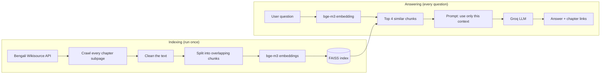

# অব্যক্ত — Knowledge Base Chatbot


[](LICENSE)

A Bengali question-answering chatbot built on a Retrieval-Augmented Generation (RAG) pipeline. It
answers questions about one book, **অব্যক্ত** by জগদীশচন্দ্র বসু, using only the text of that book,
and it cites the chapter each answer comes from. When the book does not contain the answer, the
chatbot says so instead of guessing.

## Contents

- [Book information](#book-information)
- [How it works](#how-it-works)
- [Technical details](#technical-details)
- [Results](#results)
- [Setup and running](#setup-and-running)
- [Project structure](#project-structure)
- [Limitations and known issues](#limitations-and-known-issues)
- [Troubleshooting](#troubleshooting)
- [License](#license)


## Book information

|                     |                                                              |
| ------------------- | ------------------------------------------------------------ |
| **Book**            | অব্যক্ত (_Abyakta_)                                          |
| **Author**          | জগদীশচন্দ্র বসু (Jagadish Chandra Bose)                      |
| **First published** | 1921 (Ashwin 1328), by বঙ্গীয় বিজ্ঞান পরিষদ                 |
| **Source**          | [Bengali Wikisource](https://bn.wikisource.org/wiki/অব্যক্ত) |

_Abyakta_ is a collection of about twenty prose pieces: popular-science essays on plants, sound,
light and the "ether", essays on the struggle behind scientific discovery, and a few stories such as
the comic science story _পলাতক তুফান_. It is prose, every piece is its own Wikisource subpage, and
the content is factual, which suits a question-answering system. The text is in classical Bengali
(সাধু ভাষা), while questions are usually asked in modern Bengali (চলিত), so retrieval has to match
meaning rather than exact words.

## How it works

The system has two phases. **Indexing** runs once and prepares the book. **Answering** runs for
every question.



In one line: **Wikisource → Crawling → Cleaning → Chunking → Embeddings → Vector DB → Retrieval → LLM → Answer + Citation**

| Step       | What happens                                                                                                                                                                                                                                                              | File                                                       |
| ---------- | ------------------------------------------------------------------------------------------------------------------------------------------------------------------------------------------------------------------------------------------------------------------------- | ---------------------------------------------------------- |
| Crawling   | Asks the MediaWiki API for every page whose title starts with `অব্যক্ত/`, so no chapter list is hard-coded. Each page is downloaded and reduced to book text (navigation, page numbers and footnote markers are removed). Rate-limit responses are retried automatically. | [`src/ingest.py`](src/ingest.py)                           |
| Cleaning   | Unicode NFC normalisation, removal of invisible characters, footnote markers and extra whitespace. Zero-width joiners are kept because some Bengali letters need them.                                                                                                    | [`src/chunking.py`](src/chunking.py)                       |
| Chunking   | Each chapter is split into overlapping chunks at paragraph, line and sentence (`।`) boundaries. Every chunk stores its book, chapter, section and source URL.                                                                                                             | [`src/chunking.py`](src/chunking.py)                       |
| Embeddings | `BAAI/bge-m3` turns every chunk into a vector.                                                                                                                                                                                                                            | [`src/vector_store.py`](src/vector_store.py)               |
| Vector DB  | The vectors are stored in a FAISS index saved to disk, one index per chunking strategy.                                                                                                                                                                                   | [`src/vector_store.py`](src/vector_store.py)               |
| Retrieval  | The question is embedded with the same model and the 4 nearest chunks are fetched.                                                                                                                                                                                        | [`src/rag_chain.py`](src/rag_chain.py)                     |
| Generation | The chunks and the question go into a prompt that tells the LLM to use only that context and to answer in Bengali.                                                                                                                                                        | [`src/rag_chain.py`](src/rag_chain.py)                     |
| Citation   | Source links are built from the metadata of the retrieved chunks, not written by the LLM, so a citation always points to a real chapter.                                                                                                                                  | [`src/rag_chain.py`](src/rag_chain.py), [`app.py`](app.py) |

**Questions the book cannot answer.** The prompt tells the model to reply with one fixed sentence
(_"দুঃখিত, এই প্রশ্নের উত্তর বইটিতে পাওয়া যায়নি।"_) when the context does not contain the answer.
The app detects that sentence, shows it, and displays no sources.

## Technical details

| Item                   | Choice                                                                      | Why                                                                                                                                   |
| ---------------------- | --------------------------------------------------------------------------- | ------------------------------------------------------------------------------------------------------------------------------------- |
| Embedding model        | `BAAI/bge-m3`                                                               | Multilingual, supports Bengali, needs no query or passage prefixes, and matches meaning across the সাধু / চলিত gap.                   |
| Chunk size and overlap | 500 / 100 characters (default)                                              | About a short paragraph, so a chunk holds one idea. The overlap keeps an answer that falls on a boundary whole in at least one chunk. |
| Splitting rule         | Paragraph, then line, then sentence end (`।`), then space                   | Chunks break at natural places, not mid-sentence.                                                                                     |
| Metadata               | `book`, `chapter`, `section` (part _n_ of _N_ in the chapter), `source_url` | Used for citations.                                                                                                                   |
| Vector database        | FAISS (`faiss-cpu`)                                                         | Simple, fast, stored as plain files.                                                                                                  |
| Retriever              | Similarity search, top **k = 4**                                            | Enough context without flooding the prompt.                                                                                           |
| LLM                    | Groq `openai/gpt-oss-20b`, temperature 0                                    | Free tier; temperature 0 keeps answers factual and repeatable. The model name can be changed in `.env`.                               |
| Interface              | Streamlit chat UI                                                           | Minimal code, runs in the browser.                                                                                                    |

Every value above is defined in one place, [`src/config.py`](src/config.py).

## Results

The evaluation ([`src/evaluate.py`](src/evaluate.py)) asks the chatbot 10 test questions and
compares two chunking strategies. The questions, expected answers and source chapters are stored in
[`tests/test_questions.json`](tests/test_questions.json). Nine questions have an answer in the book;
question 10 asks about something the book does not say, to check that the chatbot refuses instead of
guessing. The block below is written by `python -m src.evaluate`, and the same tables are saved in
[`RESULTS.md`](RESULTS.md).

<!-- RESULTS:START -->

### Test questions

**9 of 10 passed.**

### Chunking strategy comparison

| Strategy | Chunk size / overlap | Chunks | Hit@1 | Hit@4 |
| -------- | -------------------- | ------ | ----- | ----- |
| small    | 500 / 100            | 651    | 7/9   | 9/9   |
| large    | 1000 / 200           | 353    | 7/9   | 9/9   |

A hit means a retrieved chunk is from the right chapter and contains the answer keyword.

<!-- RESULTS:END -->

Of the nine answerable questions, 8 passed. The one question that cannot be answered from the book
(question 10) passed too, because the chatbot refused.

### Every test question

These are the chatbot's actual answers from the evaluation run above. "Passage retrieved" says
whether one of the 4 retrieved chunks was from the expected chapter and contained the answer keyword.

| #   | Question                                                                                  | Expected answer                                                        | Chapter                       | Chatbot answer                                                         | Passage retrieved | Result |
| --- | ----------------------------------------------------------------------------------------- | ---------------------------------------------------------------------- | ----------------------------- | ---------------------------------------------------------------------- | ----------------- | ------ |
| 1   | লেখক অজন্তার গুহামন্দিরের বাইরে এসে পর্বতগাত্রে কার মূর্তি খোদিত দেখলেন?                  | প্রশান্ত বুদ্ধমূর্তি                                                   | যুক্তকর                       | প্রশান্ত বুদ্ধমূর্তি।                                                  | yes               | PASS   |
| 2   | সূর্য পৃথিবী থেকে কত দূরে অবস্থিত বলে লেখক উল্লেখ করেছেন?                                 | নয় কোটি মাইল                                                          | আকাশ-স্পন্দন ও আকাশ-সম্ভব জগৎ | নয় কোটি মাইল দূরে অবস্থিত।                                            | yes               | PASS   |
| 3   | লেখকের মতে অতি প্রকাণ্ড বটগাছ কত ছোট বীজ থেকে জন্মায়?                                    | সরিষার চেয়েও ছোট বীজ থেকে                                             | গাছের কথা                     | সরিষা অপেক্ষা ছোট বীজ থেকে জন্মায়।                                    | yes               | PASS   |
| 4   | অঙ্কুর বের হওয়ার পর যে অংশ মাটির ভিতরে যায় এবং যে অংশ উপরের দিকে বাড়ে, সেগুলোর নাম কী? | মাটির ভিতরের অংশের নাম মূল, উপরের অংশের নাম কাণ্ড                      | উদ্ভিদের জন্ম ও মৃত্যু        | মূল এবং কাণ্ড।                                                         | yes               | PASS   |
| 5   | ইতালির অধ্যাপক গ্যালভানিকে লোকেরা কী নামে উপহাস করত?                                      | 'ব্যাঙ-নাচানো' অধ্যাপক                                                 | মন্ত্রের সাধন                 | লোকেরা তাকে “ব্যাঙ‑নাচান” অধ্যাপক বলে উপহাস করত।                       | yes               | PASS   |
| 6   | সোয়ার্জ কোন ধাতু দিয়ে বেলুন তৈরি করেছিলেন?                                              | আলুমিনিয়াম                                                            | মন্ত্রের সাধন                 | অ্যালুমিনিয়াম।                                                        | yes               | PASS   |
| 7   | জাহাজে প্রচণ্ড ঝড়ের সময় লেখক ঢেউ শান্ত করতে সমুদ্রে কী ঢেলে দিয়েছিলেন?                 | 'কুন্তল-কেশরী' নামের কেশতৈল                                            | পলাতক তুফান                   | তিনি সমুদ্রে তৈল ঢেলে দিয়েছিলেন।                                      | yes               | PASS   |
| 8   | লঙ্কাদ্বীপ যাওয়ার জন্য লেখক কোন জাহাজে সমুদ্রযাত্রা করেছিলেন?                            | চুসান জাহাজে                                                           | পলাতক তুফান                   | চুসান জাহাজে।                                                          | yes               | PASS   |
| 9   | লেখক ছোটবেলায় নদীকে জিজ্ঞাসা করলে নদী কী উত্তর দিত?                                      | নদী উত্তর দিত, "মহাদেবের জটা হইতে"                                     | ভাগীরথীর উৎস-সন্ধানে          | লেখক ছোটবেলায় নদীকে জিজ্ঞাসা করলে নদী উত্তর দিত, “মহাদেবের জটা হইতে।” | yes               | PASS   |
| 10  | জগদীশচন্দ্র বসু কত সালে নোবেল পুরস্কার পেয়েছিলেন?                                        | বইটিতে এর উল্লেখ নেই। চ্যাটবটের বলা উচিত যে উত্তর বইয়ে পাওয়া যায়নি। | (not in book)                 | দুঃখিত, এই প্রশ্নের উত্তর বইটিতে পাওয়া যায়নি।                        | -                 | PASS   |

**How a question is scored.** An answerable question passes when the chatbot gives an answer (not the
refusal) and that answer contains one of the question's keywords. Question 10 passes when the chatbot
refuses. Keyword matching is approximate: a correct answer worded without the keyword counts as a
fail, and a wrong answer that happens to contain it would count as a pass. Question 6 shows why the
keyword list holds both spellings: the chatbot wrote অ্যালুমিনিয়াম, while the expected answer uses
আলুমিনিয়াম. Before scoring, the evaluation also checks that every expected chapter and keyword
exists in the crawled text and prints a warning if not.

### What the results show

- **Answers stay inside the book.** Where the chatbot answered, its answers match the expected
  answers. Question 9's answer quotes the book's own phrase. The one question that has no
  answer in the book (question 10) got the refusal message.
- **Retrieval found a matching chunk every time.** For all 9 answerable questions, one of the top
  4 chunks came from the right chapter and contained the answer keyword (Hit@4 = 9/9). Question 7
  shows the limit of this check: a chunk can contain the keyword without holding the exact
  answering sentence.
- **Why k = 4 and not 1.** The right passage was the first result for 7 of the 9 questions
  (Hit@1 = 7/9) but within the top 4 for all 9. Passing several chunks to the LLM recovers the
  cases where the best chunk is not ranked first.
- **One failure: question 7.** The chatbot answered with the refusal message even though the
  retrieval check passed. The failure therefore happened when the answer was generated, not when the
  passage was ranked. See [Limitations and known issues](#limitations-and-known-issues).

### Bonus: two chunking strategies compared

|                      | Strategy A: `small`  | Strategy B: `large`   |
| -------------------- | -------------------- | --------------------- |
| Chunk size / overlap | 500 / 100 characters | 1000 / 200 characters |
| Chunks in the index  | 651                  | 353                   |
| Hit@1                | 7/9                  | 7/9                   |
| Hit@4                | 9/9                  | 9/9                   |

Both strategies use the same embedding model and the same 9 answerable questions. For each question
the retriever returns chunks and a hit is counted if a chunk from the right chapter contains the
answer keyword.

The two strategies **tied**. With only 9 questions, one question moves a score by about 11 points,
so this test cannot separate them. `small` is the default because a prompt with four small chunks
carries at most half as much text as one with four large chunks. That is a design choice for speed
and cost, not a measured accuracy advantage.

## Setup and running

**Requirements:** Python 3.10 or newer and a free [Groq API key](https://console.groq.com/keys).

```bash
# 1. Create and activate a virtual environment
python -m venv .venv
source .venv/bin/activate          # Windows PowerShell: .venv\Scripts\Activate.ps1

# 2. Install dependencies (the first install is large because of PyTorch)
pip install -r requirements.txt

# 3. Add your Groq key
cp .env.example .env               # Windows: copy .env.example .env
#    then open .env and paste your key

# 4. Run the steps in order
python -m src.ingest               # crawl the book from Wikisource -> data/chapters.json
python -m src.build_index          # chunk, embed and save the FAISS indexes -> vector_store/
streamlit run app.py               # start the chatbot in your browser
python -m src.evaluate             # run the 10 test questions and the chunking comparison
```

- The first `build_index` run downloads the embedding model (about 2 GB). Later runs reuse it.
- `python -m src.evaluate --retrieval-only` runs only the chunking comparison and needs no API key.
- `data/` and `vector_store/` are generated locally and are not committed to the repository.

### Configuration

| Setting                             | Where                            | Purpose                                                                                                |
| ----------------------------------- | -------------------------------- | ------------------------------------------------------------------------------------------------------ |
| `GROQ_API_KEY`                      | `.env`                           | Your Groq key (required for the chatbot and the full evaluation).                                      |
| `GROQ_MODEL`                        | `.env`                           | Overrides the default LLM if Groq retires it.                                                          |
| Chunk sizes, top-k, embedding model | [`src/config.py`](src/config.py) | Change once; every step picks it up. Rebuild the index after changing chunking or the embedding model. |

## Project structure

```
abyakta-rag-chatbot/
├── app.py                  # Streamlit chat interface
├── requirements.txt
├── .env.example            # copy to .env and add GROQ_API_KEY
├── LICENSE
├── RESULTS.md              # generated by src.evaluate: every test answer
├── src/
│   ├── config.py           # every setting in one place
│   ├── ingest.py           # step 1: crawl Wikisource
│   ├── chunking.py         # cleaning, chunking, metadata
│   ├── vector_store.py     # embeddings and FAISS build/load
│   ├── build_index.py      # step 2: build the indexes
│   ├── rag_chain.py        # retriever, LLM, citations
│   └── evaluate.py         # step 4: test questions and chunking comparison
├── tests/
│   └── test_questions.json # 10 questions with expected answers
├── data/                   # created by step 1 (not committed)
└── vector_store/           # created by step 2 (not committed)
```

## Limitations and known issues

- **Question 7 fails (open issue).** The chatbot refused a question the book does answer. The
  retrieval check passed, so the cause is in the generation step, but this run does not show which
  of two things is responsible, and neither has been confirmed:
  - The "hit" rule only checks that the keyword `কুন্তল` appears in a retrieved chunk from the right
    chapter. The hair oil is introduced earlier in that story, so a chunk can contain the keyword
    without containing the passage where the oil is poured into the sea.
  - The prompt tells the model to refuse unless the context contains the answer. This question needs
    the model to connect "the waves calmed" with "the oil", and a strict model may refuse instead.

  The refusal behaviour that caused this failure is also what made question 10 pass, so loosening
  the prompt needs to be checked against that question.

- **Small test set.** Nine answerable questions and one refusal question are enough to catch broken
  behaviour, not to rank close alternatives. The chunking comparison is a tie for this reason.
- **Keyword-based scoring.** Pass and hit checks look for a keyword, not for meaning, so they can
  miss correct answers phrased differently and can count a chunk as a hit without it holding the
  exact answering sentence.
- **Section labels are positions.** The `section` metadata says "part _n_ of _N_" within a chapter;
  it is not a heading taken from the book.
- **Answers depend on the LLM.** The prompt restricts the model to the retrieved context, but a
  language model can still misread or refuse a passage. Sources are shown so answers can be checked.
- **Depends on Wikisource markup.** The crawler removes navigation and page numbers using the page
  structure; a change in that structure could require updating the selectors in `src/ingest.py`.

## Troubleshooting

| Problem                                         | Fix                                                                                                                                                                                |
| ----------------------------------------------- | ---------------------------------------------------------------------------------------------------------------------------------------------------------------------------------- |
| `429 Too Many Requests` during `src.ingest`     | The crawler already waits and retries. If it still fails, wait a few minutes and run it again. Adding your email or GitHub link to the `User-Agent` in `src/ingest.py` also helps. |
| `Vector index 'small' not found`                | Run `python -m src.build_index` first.                                                                                                                                             |
| `GROQ_API_KEY is missing`                       | Copy `.env.example` to `.env` and paste your key.                                                                                                                                  |
| The Groq model is not found                     | Set `GROQ_MODEL` in `.env` to a model your key can use.                                                                                                                            |
| A test-question warning about a missing keyword | Wikisource may spell the word differently; update the `keywords` in `tests/test_questions.json`.                                                                                   |

## License

The code in this repository is released under the [MIT License](LICENSE).

The book text is not included in this repository. It is downloaded from
[Bengali Wikisource](https://bn.wikisource.org) when you run `src.ingest`, and remains subject to the
terms of that source.
